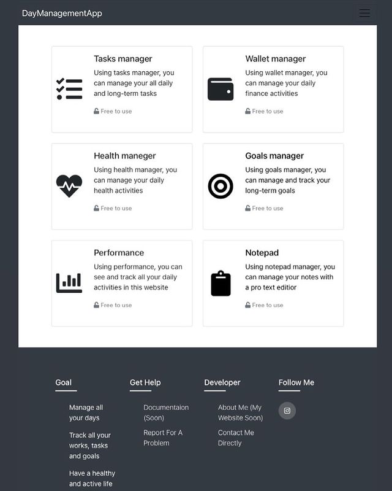

# Day management app Rest API
Day managment app is a Rest API backend built with Django rest framework as a practice project. 
It's used to manage your day. Including your tasks, goals, wallet, and calories.

## Features
- Managing daily and weekly To-Do tasks
- Tracking long-term goals
- Managing and tracking expenses
- Tracking body weight and calories consumed

## Tech
- Python
- Django rest framework
- Heroku
- PostgreSQL


## Installation

Clone git repo.
Create your python virtual environment.
```
python3 -m venv env
```
Activate it and install requirements needed.
```
source env/bin/activate
```
```
pip3 install -r requirements.txt
```
Run the server and test the API.
```
Python3 manage.py runserver
```


## UI representation using ReactJS

### Home page


### To-Do tasks page


### Create To-Do form page


### Expenses page


### Day calories page


### Notes page


